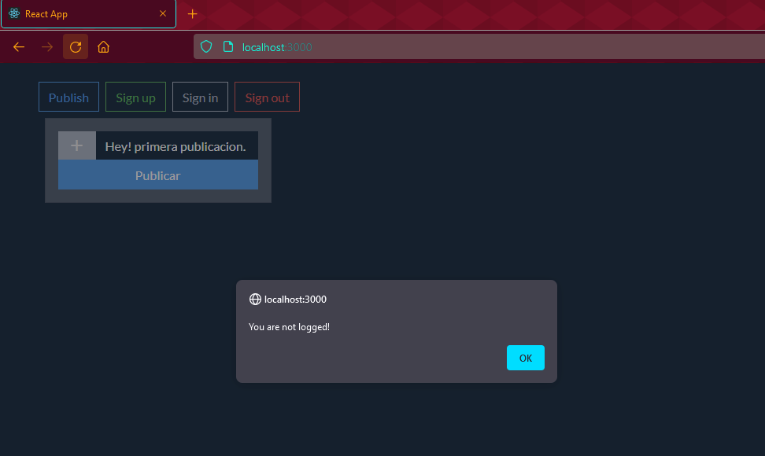

# Proyecto final muro interactivo

<em>Leuris Andres de los Santos Castillo : 20198913</em>

### `Captura de pantalla`

1. Si el usuario no ha iniciado sesion no puede publicar

2. Registrando a un nuevo usuario

3. Logeando a un usuario

4. Hacindo una publicacion luego de logearse

5. Con este boton el usuario se desconectaria de la sesion

